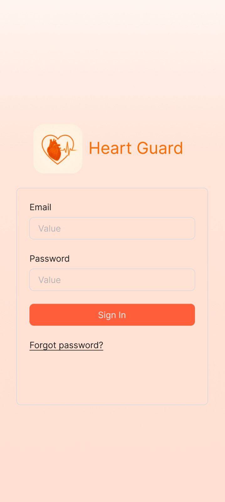
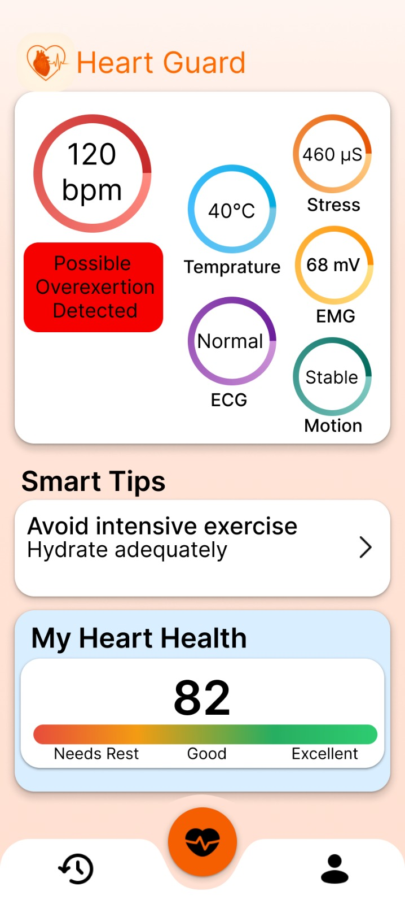
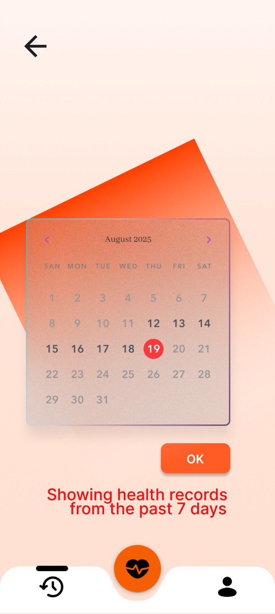
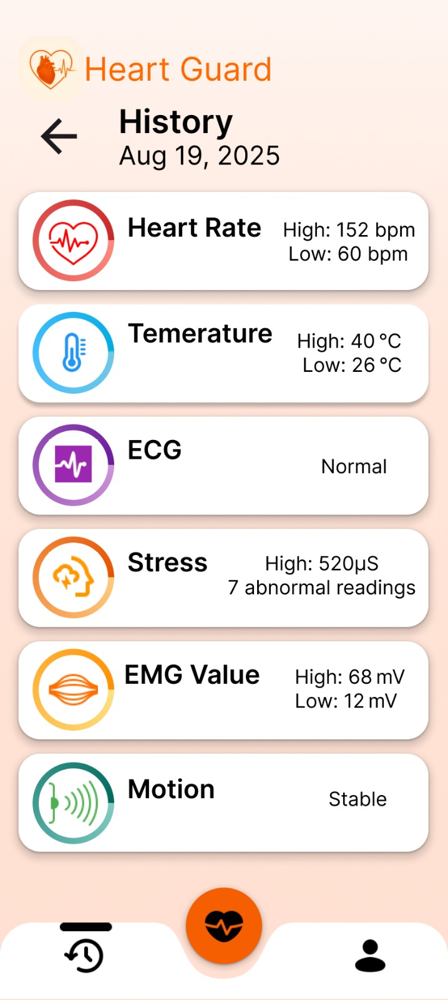
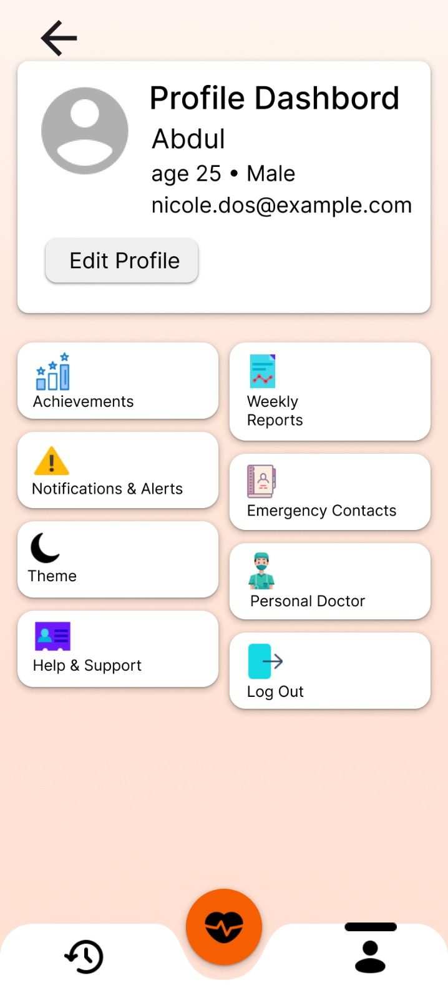
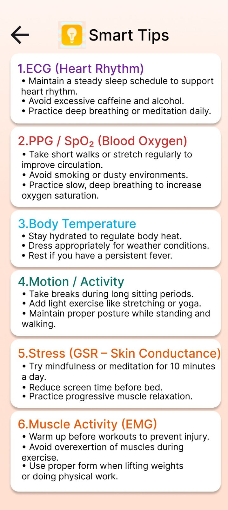

# HeartGuard – Android Frontend (Kotlin)

HeartGuard is a **Kotlin-based Android application** designed for real-time cardiovascular health monitoring.  
The app visualizes data collected from wearable biomedical sensors and provides **AI-driven health insights** to help users track heart health, stress, and physical activity.

---

## 📱 App Overview

HeartGuard enables users to:
- Monitor heart vitals in real time
- View daily & historical health records
- Receive smart health tips based on sensor data
- Track stress, ECG, EMG, motion, and temperature
- Maintain a personal health profile

---

## 🔐 Authentication Screen

<p align="center">
  
</p>

**Features**
- Email & password login
- Secure authentication flow
- Clean and minimal UI

---

## 🏠 Dashboard (Home Screen)

<p align="center">
  
</p>

**Displays**
- Heart Rate (BPM)
- Body Temperature
- ECG Status
- Stress Level (GSR)
- EMG (Muscle Activity)
- Motion Status
- AI-based warnings (e.g., overexertion)
- Overall Heart Health Score (0–100)

---

## 📅 Health Records (Calendar View)

<p align="center">
  
</p>

**Features**
- Date-wise health data selection
- View past 7 days health records
- Easy navigation using calendar UI

---

## 📜 Health History Screen

<p align="center">
  
</p>

**Shows**
- Daily max & min heart rate
- Temperature range
- ECG condition
- Stress abnormalities
- EMG activity levels
- Motion stability

---

## 👤 Profile Dashboard

<p align="center">
  
</p>

**Includes**
- User details (age, gender, email)
- Achievements
- Weekly health reports
- Notifications & alerts
- Emergency contacts
- Theme settings
- Doctor support
- Logout option

---

## ✏️ Edit Profile Screen

<p align="center">
  
</p>

**Editable Fields**
- Profile picture
- Username
- Email ID
- Phone number
- Password
- Age & gender

---

## 📡 Live Monitoring Screen

<p align="center">
  
</p>

**Real-Time Data**
- Heart Rate waveform
- Temperature
- ECG
- EMG
- Stress level
- Motion status

Designed for **continuous monitoring during workouts or daily activity**.

---

## 💡 Smart Tips Screen

<p align="center">
  
</p>

**Personalized health tips based on:**
- ECG (Heart Rhythm)
- SpO₂ / PPG
- Body Temperature
- Motion & Activity
- Stress (GSR)
- Muscle Activity (EMG)

---

## 🛠️ Tech Stack

- **Language:** Kotlin  
- **UI:** Jetpack Compose  
- **Architecture:** MVVM  
- **State Handling:** ViewModel  
- **Charts:** Custom Canvas / Graphs  
- **Backend:** Raspberry Pi (Python Dashboard)  
- **Sensors:** ECG, PPG, GSR, EMG, Temperature, IMU  
- **ML Integration:** Health score & risk insights  

---

## 📂 Project Structure (Frontend)

```text
app/
├── ui/
│   ├── screens/
│   │   ├── LoginScreen.kt
│   │   ├── DashboardScreen.kt
│   │   ├── LiveMonitoringScreen.kt
│   │   ├── HistoryScreen.kt
│   │   ├── ProfileScreen.kt
│   │   └── SmartTipsScreen.kt
│
├── components/
│   ├── CircularGauge.kt
│   ├── HealthCard.kt
│   └── BottomNavigationBar.kt
│
├── viewmodel/
│   └── HealthViewModel.kt
│
├── data/
│   └── HealthDataModel.kt
│
└── MainActivity.kt
